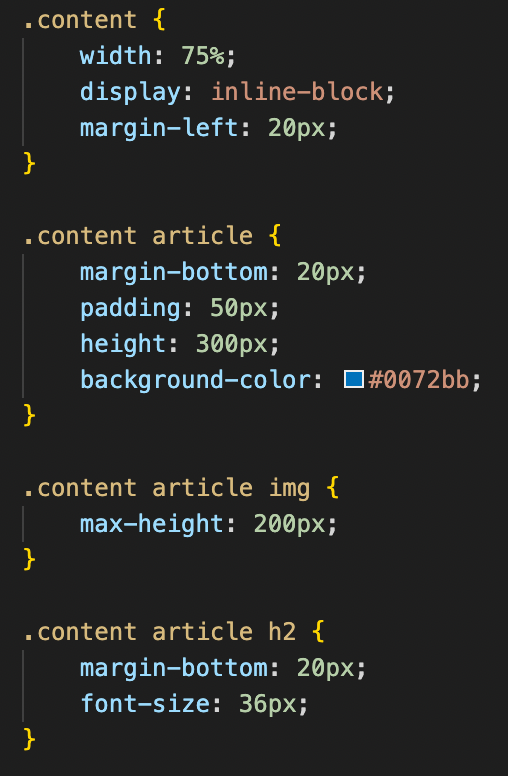
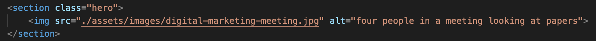
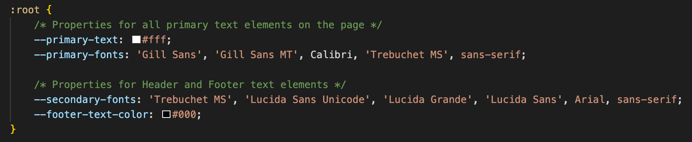

# Horiseon code-refactor
## Project description
 Horiseon needed their website to adhere to current SEO and accessibility standards. 
 
## Optimizing the code
* Replaced HTML elements that were not semantic using section and article tags. 
* Removed unnecessary individual class selectors and created class selectors for the parents of those elements. This allowed greatly reducing the lines in the CSS needed to format the page. 
* Reorganized the CSS to a logical order that better follows how content is layed out in the HTML

## Ensuring accessibility
* Removed the background image from the HERO section, replacing it with a static image placed inside the HERO section and gave it an ALT descriptor. This was done because the image in the HERO section is not purely decorative and it's content is important to be visible for screen readers. 
* Added ALT texts for all other images on the page that were not purely decorative.

## Enhancing readability
* Added comments in the HTML and CSS files.
* Used CSS variables to consolidate CSS elements into one and to make the CSS easier to read and modify. 

## Optimizing page load
* Reduced image file sizes as the page was fairly heavy to load.

---
## Project links

- [GitHub][1]
- [GitHub Page][2]

[1]: https://github.com/D1sl/code-refactor/
[2]: https://d1sl.github.io/code-refactor/

---
GitHub: [D1sl](https://github.com/D1sl/) 